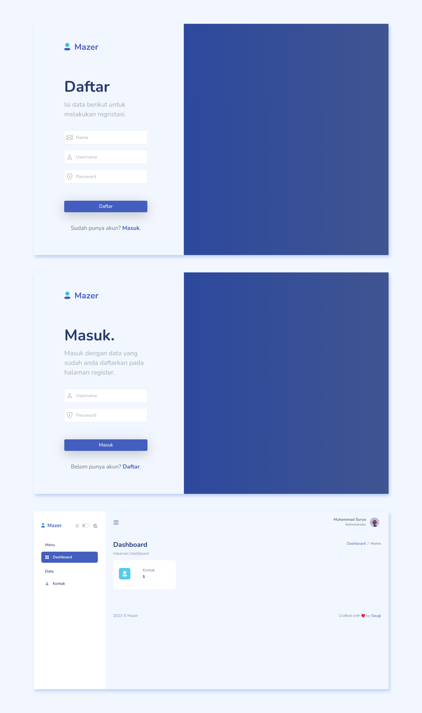

 
  

<h1 align="center">Tutorial CRUD PHP Native dengan Bootstrap 5</h1>

  

  

  

  

  

  

<!-- Status -->

<!-- <h4 align="center">
	🚧  Tutorial Crud Php Native 🚀 Under construction...  🚧
</h4>

 -->

  <a href="#dart-about">About</a> &#xa0; | &#xa0; 
  <a href="#rocket-technologies">Technologies</a> &#xa0; | &#xa0;
  <a href="#white_check_mark-requirements">Requirements</a> &#xa0; | &#xa0;
  <a href="#memo-license">License</a> &#xa0; | &#xa0;
  <a href="https://github.com/suryamsj" target="_blank">Author</a>

 

## :dart: About

Repo ini adalah hasil dari "Tutorial CRUD PHP Native dengan Bootstrap 5" di channel saya sendiri. Berikut linknya jika ingin mengikuti Tutorialnya. Youtube [Tutorial CRUD PHP Native](https://www.youtube.com/playlist?list=PL_WZjCQkM6wfUCE_P-lczHMyAbXxkBfgM)

## :rocket: Technologies

Teknologi dan Tools yang digunakan dalam Tutorial:

- [PHP](https://www.php.net/)
- [XAMPP](https://www.apachefriends.org/)
- [Visual Studio Code](https://code.visualstudio.com/)
- [Bootstrap](https://getbootstrap.com/)
- [SweetAlert2](https://sweetalert2.github.io/)
- [Simple Datatable](https://github.com/fiduswriter/Simple-DataTables)
- [Mazer Dashboard](https://zuramai.github.io/mazer/)

## :white_check_mark: Requirements

Sebelum memulai :checkered_flag:, pastikan anda mempunyai [XAMPP](https://www.apachefriends.org/) dan Text editor, misal [Visual Studio Code](https://code.visualstudio.com/).

## :memo: License

This project is under license from MIT. For more details, see the [LICENSE](LICENSE) file.

Dibuat dengan :heart: oleh <a href="https://github.com/suryamsj" target="_blank">Muhammad Surya J</a>

&#xa0;
